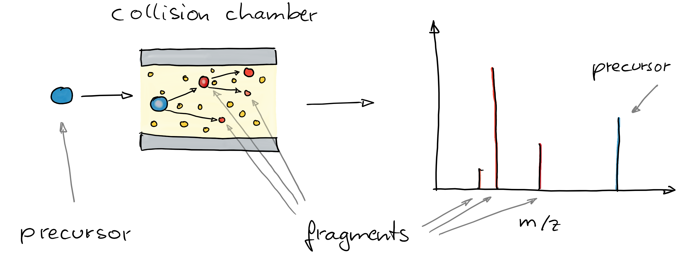
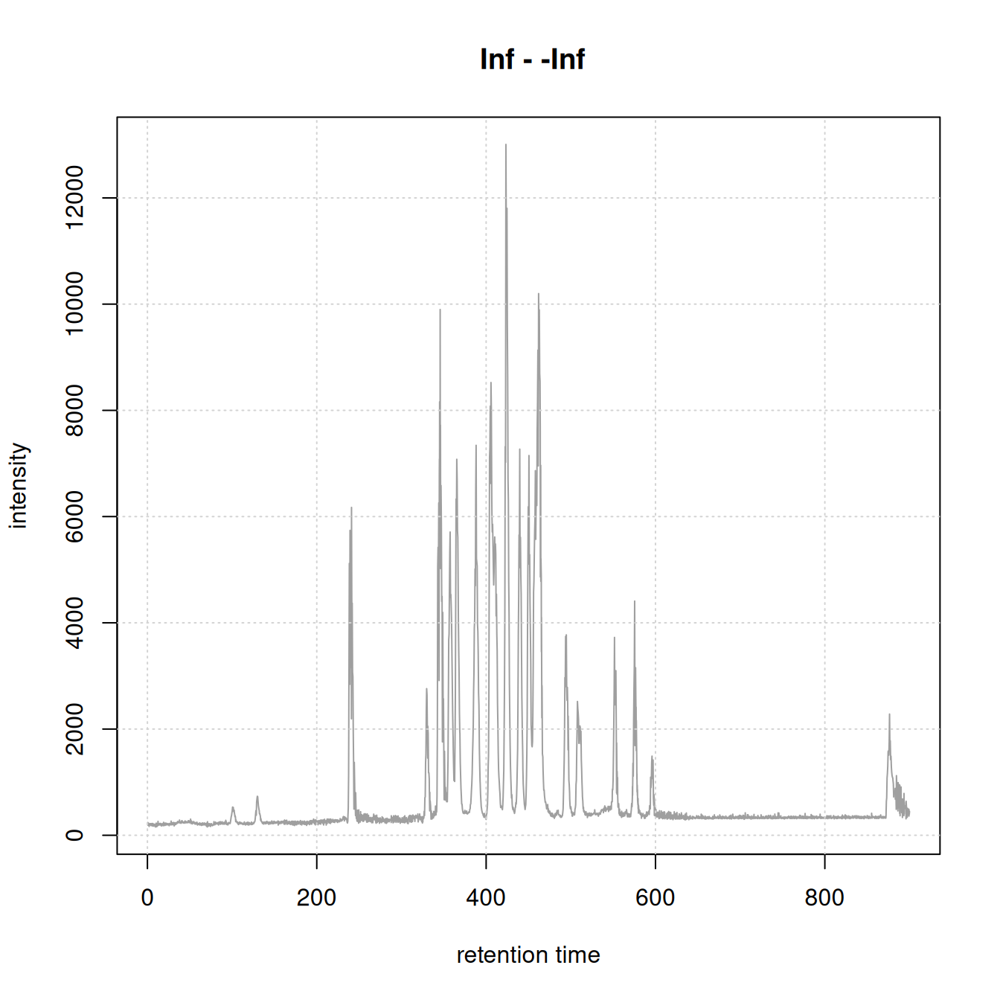
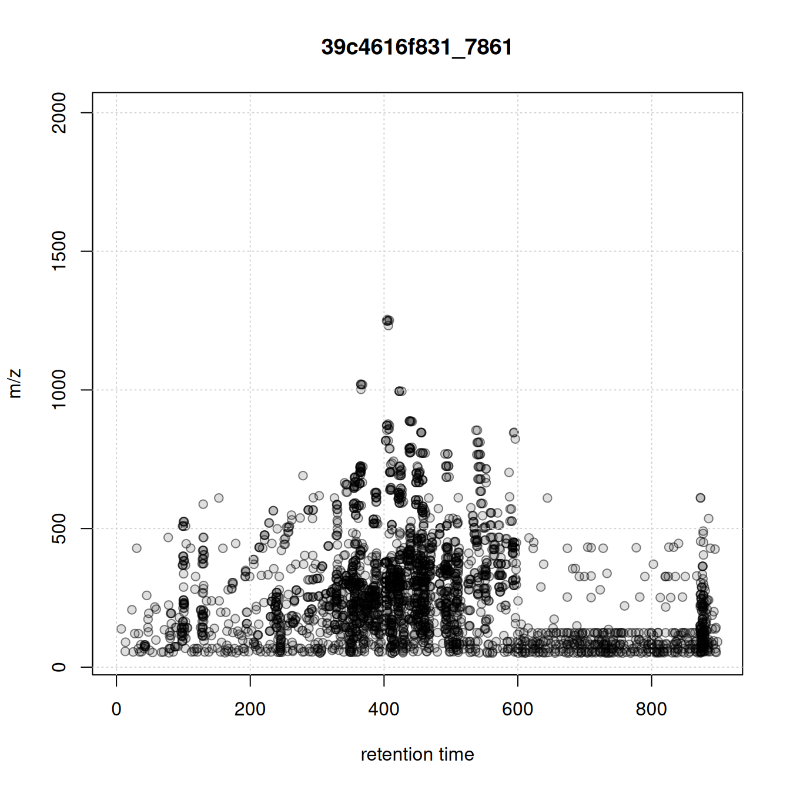
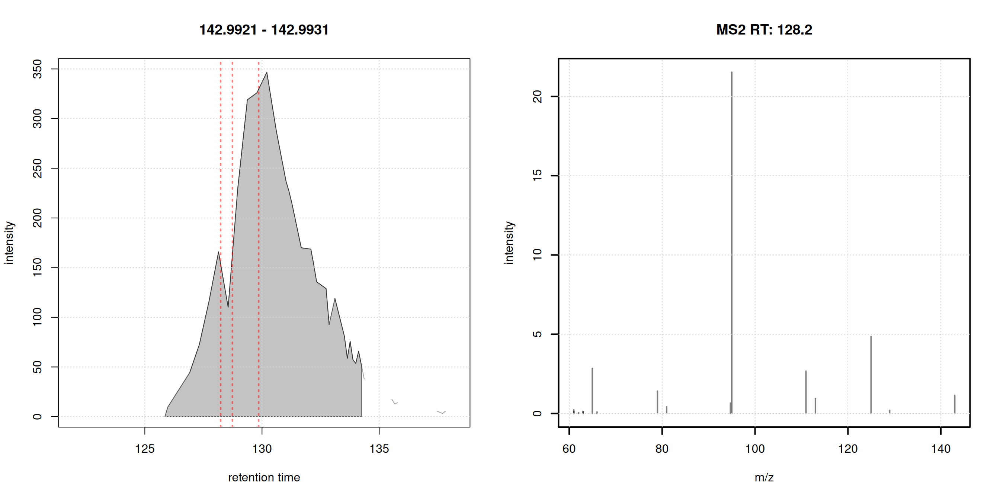
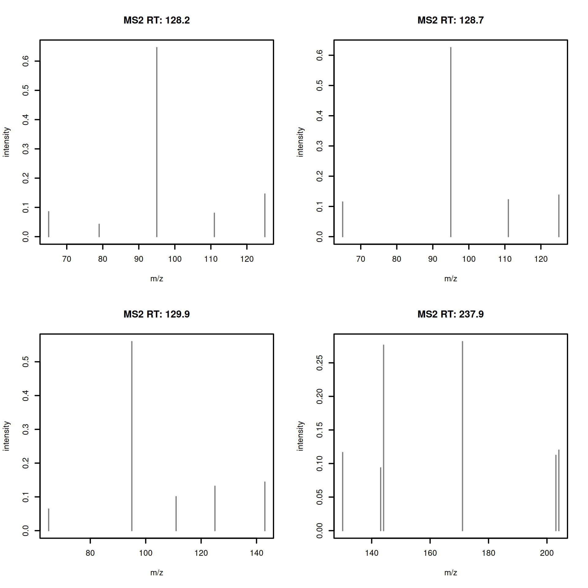
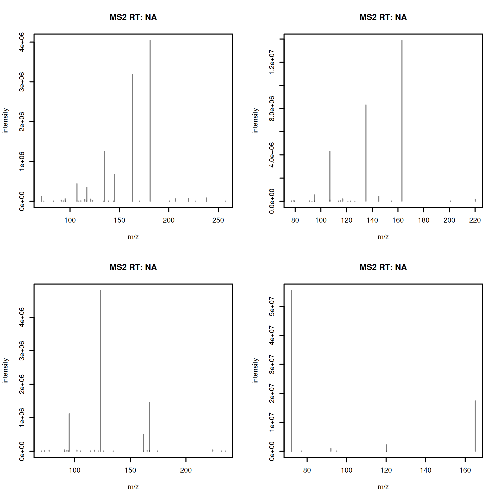
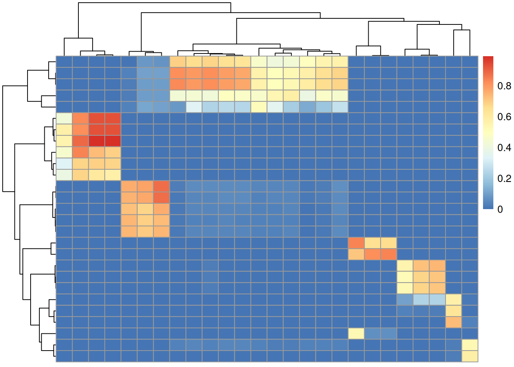
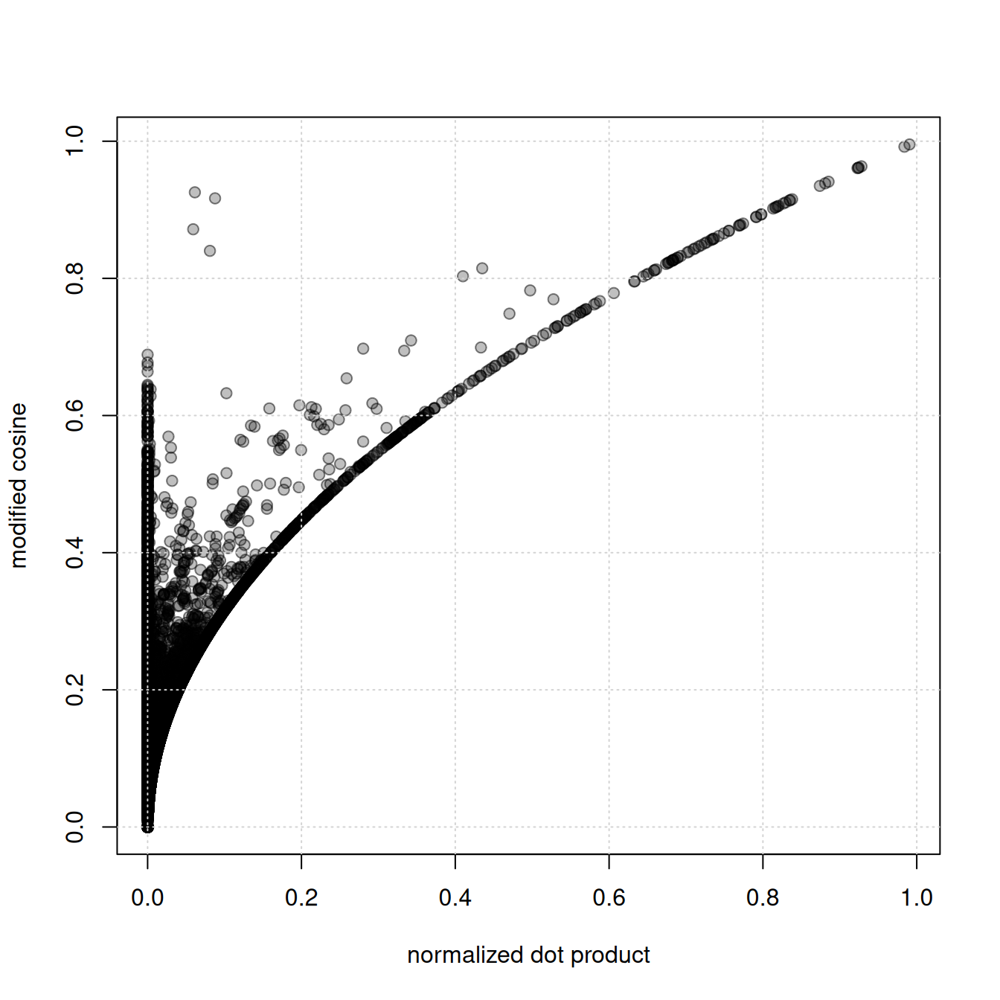
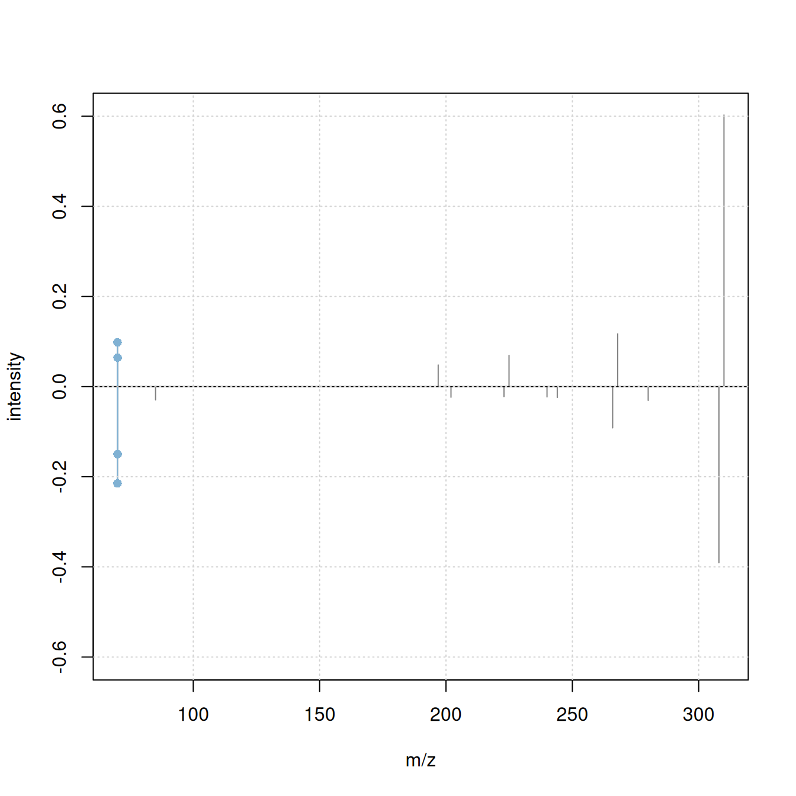
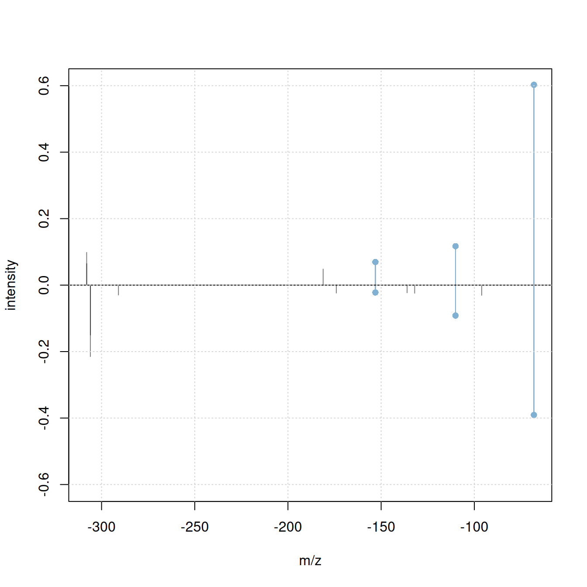

# SpectriPy: Criss-Crossing R and Python for Powerful Mass Spectrometry Data Analysis Workflows

## Outline

- 🎯 show how R and Python MS data analysis methods can be combined in a
  single (interactive) workflow.

- Parts of the analysis are performed in R, parts in Python, with the MS
  data being shared between them.

- 🍴 **Methods**:

  - Quarto document
  - R packages: *SpectriPy* ([Graeve et al.
    2025](#ref-graeve_spectripy_2025)), *Spectra*, *xcms* ([Louail et
    al. 2025](#ref-louail_xcms_2025))
  - Python libraries: *matchms* ([Huber et al.
    2020](#ref-huber_matchms_2020))

- 🔀 combine R and Python to:

  - perform chromatographic peak detection on an untargeted LC-MS/MS
    data file
  - extract and process MS2 spectra for detected chromatographic peaks
  - download public reference MS2 data and process them
  - calculate similarity between experimental and reference MS2 spectra
    for a tentative annotation of the detected chromatographic peaks

## Introduction to LC-MS/MS data

- Liquid chromatography mass spectrometry (LC-MS) is the method of
  choice in untargeted metabolomics (or small molecule - omics).
- Molecules are separated by LC, get ionized and then detected by MS.


*LC-MS setup*

- The signal is analyzed along retention time, identifying
  *chromatographic peaks*: signal from ions of the same molecule.
- These are characterized by their *m/z* and retention time.
- To improve annotation confidence, MS2 spectra are generated:
  fragmenting the ions and recording the *m/z* of their fragments.



*CID-based fragmentation*

- Such MS2 spectra provide information on the compound’s structure.


*Fragment spectrum*

- Comparing these MS2 spectra against a reference database with MS2
  spectra of pure standards can be used to annotate the LC-MS features.
- Similarity between experimental and reference spectra can be
  calculated using various methods.

## Criss-crossing R and Python for powerful MS data analysis workflows

### Data import

Load key R packages for the preprocessing of LC-MS data.

``` r

#' R session:

library(MsExperiment)
library(Spectra)
library(xcms)
library(MsDataHub)
```

**Data** (provided through *MsDataHub*): - LC-MS/MS measurement of a
pesticide mixture. - MS2 data generated with a data dependent
acquisition (DDA) strategy.

``` r

#' R session:

dda_file <- MsDataHub::PestMix1_DDA.mzML()
```

``` r

dda_data <- readMsExperiment(dda_file)
```

> **Note**
>
> ℹ️ for more information on general MS data handling and exploration
> see also the respective tutorials in 👩‍🚀
> [Metabonaut](https://rformassspectrometry.github.io/Metabonaut/)

For initial data inspection we create below the *total ion chromatogram*
(TIC) of the data and indicate for which (precursor) ions MS2 spectra
were acquired.

``` r

#' R session:

chromatogram(dda_data) |>
    plot()
grid()
plotPrecursorIons(dda_data)
grid()
```



Figure 1: Total ion chromatogram.



Figure 2: Precursor *m/z* of acquired MS2 spectra.

### MS1 data preprocessing

Next we process the MS1 data to identify and quantify chromatographic
peaks using the *[xcms](https://bioconductor.org/packages/3.23/xcms)*
package ([Louail et al. 2025](#ref-louail_xcms_2025)).

> **Note**
>
> ℹ️ For more information on peak detection and parameter settings see
> 👩‍🚀 [Metabonaut](https://rformassspectrometry.github.io/Metabonaut/)

``` r

#' R session:

cwp <- CentWaveParam(snthresh = 5, noise = 100, ppm = 10,
                     peakwidth = c(3, 30))
dda_data <- findChromPeaks(dda_data, param = cwp, msLevel = 1L)
```

- Identify and extract MS2 spectra measured for all (precursor) ions for
  each MS1 chromatographic peak.

``` r

#' R session:

#' identify and extract MS2 spectra for each chromatographic peak
dda_ms2 <- chromPeakSpectra(dda_data)
dda_ms2
```

    MSn data (Spectra) with 158 spectra in a MsBackendMzR backend:
          msLevel     rtime scanIndex
        <integer> <numeric> <integer>
    1           2   128.237      1000
    2           2   128.737      1008
    3           2   129.857      1023
    4           2   237.869      1812
    5           2   241.299      1846
    ...       ...       ...       ...
    154         2   575.255      5115
    155         2   596.584      5272
    156         2   592.424      5236
    157         2   596.054      5266
    158         2   873.714      7344
     ... 37 more variables/columns.

    file(s):
    39c4616f831_7861
    Processing:
     Filter: select MS level(s) 2 [Thu May 28 13:15:33 2026]
     Merge 1 Spectra into one [Thu May 28 13:15:33 2026] 

🔎 visualize the results:

- plot EIC of first chromatographic peak
- indicate the MS2 spectra measured for that peak (if any)
- plot the associated MS2 spectra

``` r

#' R session:

pid <- dda_ms2$chrom_peak_id[1L]
chrs <- chromPeakChromatograms(
    dda_data, peaks = pid, expandRt = 4)

par(mfrow = c(1, 2))
#' Plot the EIC
plot(chrs)
grid()
#' Subset MS2 spectra for the present chromatographic peak
s <- dda_ms2[dda_ms2$chrom_peak_id == pid]
abline(v = s$rtime, col = "#ff000080", lty = 3, lwd = 2)
plotSpectra(s[1L], lwd = 2)
grid()
```



Figure 3: Example extracted ion chromatogram (left) and associated MS2
spectrum (right).

Each chromatographic peak represents the signal for an ion of a molecule
(pesticide?) present in the sample. In untargeted metabolomics we don’t
know the identity of these molecules (yet).

### MS2-based annotation of MS1 signals

MS2 (fragment) spectra generated from ions collected for MS1 signals can
provide information on the structure of the measured compound. In
MS2-based annotation workflows such *experimental* MS2 spectra are
compared against *reference* spectra, i.e., MS2 spectra generated from
ions of known origin.

#### Clean and process chromatographic peaks’ MS2 spectra

- 🧹 clean MS2 data:
  - remove peaks with an intensity below 5% of the maximum peak
    intensity
  - *reduce* spectra: for peaks with similar *m/z* value (difference \<
    20ppm) keep only the peak with the higher intensity
  - remove the precursor peak from the spectra
  - scale peak intensities per spectrum such that their intensities sum
    up to 1
  - keep only spectra with at least 4 fragment peaks.

``` r

#' R session:

#' filter function to remove peaks with an intensity < 5% of max intensity
low_int <- function(x, ...) {
    x > max(x, na.rm = TRUE) * 0.05
}

#' clean and filter peaks
dda_ms2 <- filterIntensity(dda_ms2, intensity = low_int) |>
    reduceSpectra(ppm = 20) |>
    filterPrecursorPeaks(ppm = 20) |>
    scalePeaks()

#' keep spectra with at least 4 fragment peaks
dda_ms2 <- dda_ms2[lengths(dda_ms2) > 3]
```

``` r

#' R session:
plotSpectra(dda_ms2[1:4], lwd = 2)
```



Figure 4: Example MS2 spectra after cleaning.

#### Load reference MS2 data

- Download and import public reference MS2 spectra: GNPS pesticide data

``` r

#' R session:

url <- file.path("https://external.gnps2.org/gnpslibrary/",
                 "GNPS-COLLECTIONS-PESTICIDES-POSITIVE.mgf")

library(curl)
pest_mgf <- basename(url)
if (!file.exists(pest_mgf))
    curl_download(url, destfile = pest_mgf)

library(MsBackendMgf)
pest_ms2 <- Spectra(pest_mgf, source = MsBackendMgf())
```

- Visualize example reference spectra.

``` r

#' R session:

plotSpectra(pest_ms2[1:4], lwd = 2)
```



Figure 5: Example reference MS2 spectra.

- Clean and process the reference spectra.

``` r

#' R session:

#' apply the same processing as for experimental spectra
pest_ms2 <- filterIntensity(pest_ms2, intensity = low_int) |>
    reduceSpectra(ppm = 20) |>
    filterPrecursorPeaks(ppm = 20) |>
    scalePeaks()

pest_ms2 <- pest_ms2[lengths(pest_ms2) > 3]

length(pest_ms2)
```

    [1] 416

Rich metadata is important for annotation. The downloaded reference data
set provides some metadata information, most of it encoded in the the
spectrum’s name:

``` r

#' R session:

spectraVariables(pest_ms2)
```

     [1] "msLevel"                 "rtime"
     [3] "acquisitionNum"          "scanIndex"
     [5] "dataStorage"             "dataOrigin"
     [7] "centroided"              "smoothed"
     [9] "polarity"                "precScanNum"
    [11] "precursorMz"             "precursorIntensity"
    [13] "precursorCharge"         "collisionEnergy"
    [15] "isolationWindowLowerMz"  "isolationWindowTargetMz"
    [17] "isolationWindowUpperMz"  "MSLEVEL"
    [19] "SOURCE_INSTRUMENT"       "FILENAME"
    [21] "SEQ"                     "IONMODE"
    [23] "ORGANISM"                "NAME"
    [25] "PI"                      "DATACOLLECTOR"
    [27] "SMILES"                  "INCHI"
    [29] "INCHIAUX"                "PUBMED"
    [31] "SUBMITUSER"              "LIBRARYQUALITY"
    [33] "SPECTRUMID"              "USI"                    

``` r

pest_ms2$NAME |> head()
```

    [1] "Pesticide3_3-Hydroxycarbofuran_C12H15NO4_3,7-Benzofurandiol, 2,3-dihydro-2,2-dimethyl-, 7-(methylcarbamate) M+H"
    [2] "Pesticide3_Dioxacarb_C11H13NO4_Phenol, 2-(1,3-dioxolan-2-yl)-, methylcarbamate M+H"
    [3] "Pesticide3_Monolinuron_C9H11ClN2O2_Urea, N'-(4-chlorophenyl)-N-methoxy-N-methyl- M+H"
    [4] "Pesticide3_Metobromuron_C9H11BrN2O2_Urea, N'-(4-bromophenyl)-N-methoxy-N-methyl- M+H"
    [5] "Pesticide3_Diethofencarb_C14H21NO4_Powmil M+H"
    [6] "Pesticide3_Linuron_C9H10Cl2N2O2_Urea, N'-(3,4-dichlorophenyl)-N-methoxy-N-methyl- M+H"                          

😫 metadata is not *clean* nor complete: adduct information is encoded
in the spectrum name.

That’s a common problem with public, community-based, annotation
resources: lack of strict format and reporting standard: metadata needs
to be harmonized.

💪 Python’s *matchms* library provides metadata harmonization filters
([Jonge et al. 2024](#ref-de_jonge_reproducible_2024)) for GNPS data:

- remove non-compound name parts from the name field
- extract adduct from the name field
- set and correct ionmode
- check and correct the precursor’s charge
- add proper precursor m/z and parent mass values
- fix misplaced annotations
- fix INCHI and SMILES entries and derive InChiKeys

🐍 enters *SpectriPy*: we translate the MS data to a Python MS data
structure to allow applying the *matchms* filters (in Python):

- define which metadata (spectra) variables to translate using
  [`spectraVariableMapping()`](https://rdrr.io/pkg/Spectra/man/spectraVariableMapping.html).
- use
  [`setBackend()`](https://rdrr.io/pkg/ProtGenerics/man/backendInitialize.html)
  with a `MsBackendPy` to translate the data to Python.

``` r

#' R session:

library(SpectriPy)

#' define which spectra variables to transfer to python
map <- c(defaultSpectraVariableMapping(), NAME = "name",
         INCHI = "inchi", SMILES = "smiles", USI = "usi",
         SPECTRUMID = "spectrumid")

#' transfer the data to Python
pest_ms2 <- setBackend(pest_ms2, MsBackendPy(),
                       spectraVariableMapping = map,
                       pythonVariableName = "pest_py")
```

The `pest_ms2` is a regular `Spectra` object, only that the data is now
no longer in R, but in Python.

#### Internals of the `MsBackendPy` backend

- All data is in Python as a Python list of `matchms.Spectrum` objects.
- R keeps only the reference to the Python variable name and an index.
- Subset operations are *delayed*, only the index is subset, but not the
  data.
- Data manipulation operations on a `Spectra` object are cached and
  added to a processing queue. They are only applied in R if peaks data
  is accessed.
- `MsBackendPy` supports also replacing peaks and metadata as well as
  adding new metadata (spectra variables).

``` r

#' R session:

#' the Python variable name
pest_ms2@backend@py_var
```

    [1] "pest_py"

#### 🐍 Clean and harmonize metadata in Python

We next proceed and harmonize the metadata using the respective filters
from the *matchms* Python library.

``` python
#' Python session:

from matchms.filtering import *

for i, s in enumerate(pest_py):
    s = default_filters(s)
    s = derive_inchi_from_smiles(s)
    s = derive_smiles_from_inchi(s)
    s = derive_inchikey_from_inchi(s)
    s = derive_formula_from_smiles(s)
    pest_py[i] = clean_adduct(s)
```

We gained now additional metadata (spectra variables): *compound_name*
and *adduct*.

``` r

#' R session:

spectraVariables(pest_ms2)
```

     [1] "msLevel"                 "rtime"
     [3] "acquisitionNum"          "scanIndex"
     [5] "dataStorage"             "dataOrigin"
     [7] "centroided"              "smoothed"
     [9] "polarity"                "precScanNum"
    [11] "precursorMz"             "precursorIntensity"
    [13] "precursorCharge"         "collisionEnergy"
    [15] "isolationWindowLowerMz"  "isolationWindowTargetMz"
    [17] "isolationWindowUpperMz"  "adduct"
    [19] "compound_name"           "formula"
    [21] "INCHI"                   "inchikey"
    [23] "ionmode"                 "SMILES"
    [25] "spectrum_id"             "USI"                    

``` r

pest_ms2$adduct |> head()
```

    [1] "[M+H]+" "[M+H]+" "[M+H]+" "[M+H]+" "[M+H]+" "[M+H]+"

``` r

pest_ms2$formula |> head()
```

    [1] "C12H15NO4"    "C11H13NO4"    "C9H11ClN2O2"  "C9H11BrN2O2"  "C14H21NO4"
    [6] "C9H10Cl2N2O2"

``` r

pest_ms2$compound_name |> head()
```

    [1] "Pesticide3_3-Hydroxycarbofuran_C12H15NO4_3,7-Benzofurandiol, 2,3-dihydro-2,2-dimethyl-, 7-(methylcarbamate)"
    [2] "Pesticide3_Dioxacarb_C11H13NO4_Phenol, 2-(1,3-dioxolan-2-yl)-, methylcarbamate"
    [3] "Pesticide3_Monolinuron_C9H11ClN2O2_Urea, N'-(4-chlorophenyl)-N-methoxy-N-methyl-"
    [4] "Pesticide3_Metobromuron_C9H11BrN2O2_Urea, N'-(4-bromophenyl)-N-methoxy-N-methyl-"
    [5] "Pesticide3_Diethofencarb_C14H21NO4_Powmil"
    [6] "Pesticide3_Linuron_C9H10Cl2N2O2_Urea, N'-(3,4-dichlorophenyl)-N-methoxy-N-methyl-"                          

That’s actually great! We don’t need to (re-)implement metadata
harmonization methods in R but use directly the established
functionality ([Jonge et al. 2024](#ref-de_jonge_reproducible_2024)) in
Python.

Note that any changes to the data in Python affected also immediately
the data in R (because the `MsBackendPy` only interfaces the data, but
does not contain any data itself).

#### Calculate similarity between experimental and reference MS2 spectra

We will now proceed and calculate spectra similarity between our
experimental data and the GNPS pesticide reference library.

``` r

#' R session:

sim <- compareSpectra(dda_ms2, pest_ms2, ppm = 0, tolerance = 0.1)
```

A general overview of the similarity matrix, restricting to rows/columns
with a spectra similarity score of at least 0.5 is shown below.

``` r

#' R session:

library(matrixStats)
library(pheatmap)
simsub <- sim[rowMaxs(sim) > 0.5, colMaxs(sim) > 0.5]
pheatmap(simsub)
```



Figure 6: Similarities between experimental spectra (rows) and reference
spectra (columns). Data restricted to rows/columns with at least one
similartity score above 0.5.

Only a fraction of our 108 experimental MS2 spectra could be matched to
a reference with a similarity \> 70%.

``` r

#' R session:

sum(rowMaxs(sim) > 0.7)
```

    [1] 17

#### 🐍 Calculate spectral similarity in Python

*matchms* provides alternative spectra similarity methods that would
also account for *neutral lossess* hence possibly resulting in more or
better matches. To use these we below translate also the reference MS2
data to Python.

``` r

#' R session:

#' transfer experimental MS data to Python
map2 <- c(defaultSpectraVariableMapping(), chrom_peak_rt = "chrom_peak_rt",
          chrom_peak_mz = "chrom_peak_mz", chrom_peak_id = "chrom_peak_id",
          spectrumId = "spectrum_id")
dda_ms2 <- setBackend(dda_ms2, backend = MsBackendPy(),
                      spectraVariableMapping = map2,
                      pythonVariableName = "dda_py")
```

- Calculate spectra similarities between the experimental and reference
  spectra in Python.

``` python
#' Python session:

from matchms import calculate_scores
from matchms.similarity import ModifiedCosineHungarian

#' Calculate similarity scores
scores = calculate_scores(
    dda_py, pest_py, ModifiedCosineHungarian(tolerance = 0.1,
                                             intensity_power = 0.5))
```

``` python
sim = scores.to_array()["ModifiedCosineHungarian_score"]
```

Using the modified cosine similarity from *matchms* we got more hits:

``` r

#' R session:

sum(rowMaxs(py$sim) > 0.7)
```

    [1] 29

The code below compiles the result table for this mapping; the first 6
hits are shown.

``` r

idx <- which(py$sim > 0.7, arr.ind = TRUE)
res <- data.frame(rtime = dda_ms2$rtime[idx[, 1L]],
                  chrom_peak_id = dda_ms2$chrom_peak_id[idx[, 1L]],
                  formula = pest_ms2$formula[idx[, 2L]],
                  name = pest_ms2$compound_name[idx[, 2L]],
                  sim = py$sim[idx])
res <- res[order(res$rtime), ]
head(res)
```

         rtime chrom_peak_id       formula                                 name
    19 401.028          CP36 C15H16Cl3N3O2 Pesticide4_Prochloraz_C15H16Cl3N3O2_
    49 401.028          CP36 C15H16Cl3N3O2 Pesticide4_Prochloraz_C15H16Cl3N3O2_
    71 401.028          CP36 C15H16Cl3N3O2 Pesticide4_Prochloraz_C15H16Cl3N3O2_
    14 401.438          CP34 C15H16Cl3N3O2 Pesticide4_Prochloraz_C15H16Cl3N3O2_
    44 401.438          CP34 C15H16Cl3N3O2 Pesticide4_Prochloraz_C15H16Cl3N3O2_
    66 401.438          CP34 C15H16Cl3N3O2 Pesticide4_Prochloraz_C15H16Cl3N3O2_
             sim
    19 0.8715850
    49 0.9254726
    71 0.8401160
    14 0.8798988
    44 0.9385590
    66 0.8692899

#### Comparing the calculated spectra similarity scores

We next compare the similarity scores calculated in R using the
normalized dot product similarity (cosine similarity) with those from
Python’s *modified cosine* from the *matchms* library.

``` r

#' R session:

psim <- py$sim
plot(as.vector(sim), as.vector(psim), pch = 21, col = "#00000080",
     bg = "#00000040", xlab = "normalized dot product",
     ylab = "modified cosine")
grid()
```



Figure 7: Comparison of normalized dot product (x-axis) and modified
cosine (y-axis) similarity scores.

👉 the modified cosine similarity yields higher scores than the
normalized dot product (*regular* cosine similarity).

🔎 inspect spectra with high modified cosine scores, but low normalized
dot product similarity. By subtracting the precursor *m/z* from each
fragment peak’s *m/z* we generate *neutral loss* spectra.

``` r

#' R session:

#' indentify matches with the largest difference
sim_diff <- psim - sim
idx <- which(sim_diff > 0.7, arr.ind = TRUE)

#' get the respective spectra
a <- dda_ms2[idx[1, 1]]
b <- pest_ms2[idx[1, 2]]

plotSpectraMirror(a, b, ppm = 0, tolerance = 0.1)
grid()

#' calculate neutral loss version of the spectra
a_n <- shiftPeaks(a, direction = "left", offset = "precursorMz")
b_n <- shiftPeaks(b, direction = "left", offset = "precursorMz")

plotSpectraMirror(a_n, b_n, ppm = 0, tolerance = 0.1)
grid()
```



\(a\) Comparison of the original spectras’ fragments.



\(b\) Comparison of the spectras’ fragments after substracting the
precursor *m/z* of the spectra.

Figure 8: Mirror plot for spectra with high modified cosine similarity,
but low normalized dot product.

Only 2 fragment peaks were matching between the *original* spectra,
while an additional 3 fragments match if the spectra’s precursor *m/z*
is subtracted from the fragment peaks’ *m/z*.

> **Note**
>
> ℹ️ the
> [`shiftPeaks()`](https://rdrr.io/pkg/Spectra/man/addProcessing.html)
> operation was *only* added to the processing queue of the `Spectra`
> object but not immediately applied to the data. In R, the processing
> queue is applied on-the-fly to the data when requested. In Python, any
> of these data manipulations are therefore not visible. Use
> [`applyProcessing()`](https://rdrr.io/pkg/ProtGenerics/man/processingQueue.html)
> on the `Spectra` object to *realize* and apply data manipulation
> operations.
>
> ⚠️ before using
> [`applyProcessing()`](https://rdrr.io/pkg/ProtGenerics/man/processingQueue.html)
> read the
> [`?pyspec_copy_on_replace`](https://rformassspectrometry.github.io/SpectriPy/reference/pyspec_copy_on_replace.html)
> help to avoid invalidating potentially present data copies.

The difference between the spectra’s precursor *m/z* is:

``` r

a$precursorMz - b$precursorMz
```

    [1] 1.99692

> **Note**
>
> ℹ️ 1.997 matches the mass difference between the 35Cl and 37Cl
> isotopes of chlorine (Cl) that have a mass of 34.9689 and 36.9659,
> respectively. It is thus likely that the observed difference in *m/z*
> is due to presence or absence of one of the two isotopes in the
> compared fragments. This is further supported by the relative high
> percentage of natural occurrence of both isotopes (76% and 24%)
> [ref](https://www2.chemistry.msu.edu/faculty/reusch/OrgPage/mass.htm)
> and the chemical formula of the matched compound, that contains
> chlorine:

``` r

#' R session

b$formula
```

    [1] "C15H16Cl3N3O2"

Summarizing, with the *matchms* modified cosine similarity we can get
more hits for our experimental MS2 spectra. *SpectriPy* allows to
directly use this similarity measure on MS data originally processed in
R avoiding thus the need of re-implementation of the respective function
also in R. Through *SpectriPy* we could also use other powerful spectra
similarity scoring algorithms available in Python, such as *spec2vec*
([Huber et al. 2021](#ref-huber_spec2vec_2021)) or *ms2deepscore*
([Jonge et al. 2026](#ref-de_jonge_cross_2026)).

### Important notes

The shared data model used by `MsBackendPy` has some properties and
possible disadvantages a user (or developer) should be aware of to avoid
unexpected behavior:

- Change data in Python: will change the data also in R.
- Subset data in R: will subset the index to the individual spectra,
  data in Python is not changed.
- Subset data in Python: need to re-index the data in R.
- Multiple copies (or subsets) of the same original `Spectra` object
  pointing to the same variable in Python:
  [`applyProcessing()`](https://rdrr.io/pkg/ProtGenerics/man/processingQueue.html)
  can cause data corruption as the data referred to by multiple
  `Spectra` is changed. See the [Replacing data and ensuring data
  consistency](https://rformassspectrometry.github.io/SpectriPy/articles/SpectriPy.html#replacing-data-and-ensuring-data-consistency)
  section in the *SpectriPy* package vignette or
  [`?pyspec_copy_on_replace`](https://rdrr.io/pkg/SpectriPy/man/pyspec_copy_on_replace.html)
  for solutions.

### Summary

- Create more powerful data analysis workflows by combining
  functionality from R packages and Python libraries.

- **R advantages**:

  - flexible MS infrastructure: large variety of supported data and file
    formats
  - Bioconductor’s *AnnotationHub* resource
  - established preprocessing methodology for LC-MS data

- **Python advantages**:

  - more advanced spectra similarity algorithms
  - higher performance for some operations

- **Advantage of an interactive, combined R/Python workflow**:

  - can use the original implementation of the respective analysis
    methods
  - no need for re-implementation of methodology
  - make the most of both programming languages and available
    packages/libraries.

## Session information

``` r

#' R session:

sessionInfo()
```

    R version 4.6.0 (2026-04-24)
    Platform: x86_64-pc-linux-gnu
    Running under: Ubuntu 24.04.4 LTS

    Matrix products: default
    BLAS:   /usr/lib/x86_64-linux-gnu/openblas-pthread/libblas.so.3
    LAPACK: /usr/lib/x86_64-linux-gnu/openblas-pthread/libopenblasp-r0.3.26.so;  LAPACK version 3.12.0

    locale:
     [1] LC_CTYPE=en_US.UTF-8       LC_NUMERIC=C
     [3] LC_TIME=en_US.UTF-8        LC_COLLATE=en_US.UTF-8
     [5] LC_MONETARY=en_US.UTF-8    LC_MESSAGES=en_US.UTF-8
     [7] LC_PAPER=en_US.UTF-8       LC_NAME=C
     [9] LC_ADDRESS=C               LC_TELEPHONE=C
    [11] LC_MEASUREMENT=en_US.UTF-8 LC_IDENTIFICATION=C

    time zone: Etc/UTC
    tzcode source: system (glibc)

    attached base packages:
    [1] stats4    stats     graphics  grDevices utils     datasets  methods
    [8] base

    other attached packages:
     [1] pheatmap_1.0.13     matrixStats_1.5.0   SpectriPy_1.2.1
     [4] reticulate_1.46.0   MsBackendMgf_1.20.0 curl_7.1.0
     [7] MsDataHub_1.12.0    xcms_4.10.0         Spectra_1.22.0
    [10] BiocParallel_1.46.0 S4Vectors_0.50.1    BiocGenerics_0.58.1
    [13] generics_0.1.4      MsExperiment_1.14.0 ProtGenerics_1.44.0
    [16] BiocStyle_2.40.0

    loaded via a namespace (and not attached):
      [1] DBI_1.3.0                   httr2_1.2.2
      [3] rlang_1.2.0                 magrittr_2.0.5
      [5] clue_0.3-68                 snakecase_0.11.1
      [7] MassSpecWavelet_1.78.0      otel_0.2.0
      [9] compiler_4.6.0              RSQLite_3.53.1
     [11] PTMods_1.0.0                png_0.1-9
     [13] vctrs_0.7.3                 reshape2_1.4.5
     [15] stringr_1.6.0               pkgconfig_2.0.3
     [17] MetaboCoreUtils_1.20.1      crayon_1.5.3
     [19] fastmap_1.2.0               dbplyr_2.5.2
     [21] XVector_0.52.0              rmarkdown_2.31
     [23] preprocessCore_1.74.0       bit_4.6.0
     [25] purrr_1.2.2                 xfun_0.57
     [27] MultiAssayExperiment_1.38.0 cachem_1.1.0
     [29] jsonlite_2.0.0              progress_1.2.3
     [31] blob_1.3.0                  DelayedArray_0.38.2
     [33] parallel_4.6.0              prettyunits_1.2.0
     [35] cluster_2.1.8.2             R6_2.6.1
     [37] stringi_1.8.7               RColorBrewer_1.1-3
     [39] limma_3.68.3                GenomicRanges_1.64.0
     [41] Rcpp_1.1.1-1.1              Seqinfo_1.2.0
     [43] SummarizedExperiment_1.42.0 iterators_1.0.14
     [45] knitr_1.51                  IRanges_2.46.0
     [47] Matrix_1.7-5                igraph_2.3.1
     [49] tidyselect_1.2.1            abind_1.4-8
     [51] yaml_2.3.12                 doParallel_1.0.17
     [53] codetools_0.2-20            affy_1.90.0
     [55] lattice_0.22-9              tibble_3.3.1
     [57] plyr_1.8.9                  withr_3.0.2
     [59] KEGGREST_1.52.0             Biobase_2.72.0
     [61] S7_0.2.2                    evaluate_1.0.5
     [63] BiocFileCache_3.2.0         Biostrings_2.80.1
     [65] ExperimentHub_3.2.0         filelock_1.0.3
     [67] pillar_1.11.1               affyio_1.82.0
     [69] BiocManager_1.30.27         MatrixGenerics_1.24.0
     [71] foreach_1.5.2               MSnbase_2.37.0
     [73] MALDIquant_1.22.3           ncdf4_1.24
     [75] BiocVersion_3.23.1          hms_1.1.4
     [77] ggplot2_4.0.3               scales_1.4.0
     [79] glue_1.8.1                  MsFeatures_1.20.0
     [81] lazyeval_0.2.3              tools_4.6.0
     [83] AnnotationHub_4.2.0         mzID_1.50.0
     [85] data.table_1.18.4           QFeatures_1.22.0
     [87] vsn_3.80.0                  mzR_2.46.0
     [89] fs_2.1.0                    XML_3.99-0.23
     [91] grid_4.6.0                  impute_1.86.0
     [93] tidyr_1.3.2                 AnnotationDbi_1.74.0
     [95] MsCoreUtils_1.24.0          PSMatch_1.16.0
     [97] cli_3.6.6                   rappdirs_0.3.4
     [99] S4Arrays_1.12.0             dplyr_1.2.1
    [101] AnnotationFilter_1.36.0     pcaMethods_2.4.0
    [103] gtable_0.3.6                digest_0.6.39
    [105] SparseArray_1.12.2          farver_2.1.2
    [107] memoise_2.0.1               htmltools_0.5.9
    [109] lifecycle_1.0.5             httr_1.4.8
    [111] statmod_1.5.2               bit64_4.8.2
    [113] MASS_7.3-65                

## References

Graeve, Marilyn De, Wout Bittremieux, Thomas Naake, et al. 2025.
“SpectriPy: Enhancing Cross-Language Mass Spectrometry Data Analysis
with R and Python.” *Journal of Open Source Software* 10 (109): 8070.
<https://doi.org/10.21105/joss.08070>.

Huber, Florian, Lars Ridder, Stefan Verhoeven, et al. 2021. “Spec2Vec:
Improved Mass Spectral Similarity Scoring Through Learning of Structural
Relationships.” *PLOS Computational Biology* 17 (2): e1008724.
<https://doi.org/10.1371/journal.pcbi.1008724>.

Huber, Florian, Stefan Verhoeven, Christiaan Meijer, et al. 2020.
“Matchms - Processing and Similarity Evaluation of Mass Spectrometry
Data.” *Journal of Open Source Software* 5 (52): 2411.
<https://doi.org/10.21105/joss.02411>.

Jonge, Niek F. de, Elena Chekmeneva, Robin Schmid, et al. 2026. “Cross
Ionization Mode Chemical Similarity Prediction Between Tandem Mass
Spectra in Metabolomics.” *Nature Communications* 17 (1): 2483.
<https://doi.org/10.1038/s41467-026-69083-y>.

Jonge, Niek F. de, Helge Hecht, Michael Strobel, Mingxun Wang, Justin J.
J. van der Hooft, and Florian Huber. 2024. “Reproducible MS/MS Library
Cleaning Pipeline in Matchms.” *Journal of Cheminformatics* 16 (1): 88.
<https://doi.org/10.1186/s13321-024-00878-1>.

Louail, Philippine, Carl Brunius, Mar Garcia-Aloy, et al. 2025. “Xcms in
Peak Form: Now Anchoring a Complete Metabolomics Data Preprocessing and
Analysis Software Ecosystem.” *Analytical Chemistry*, ahead of print,
December. <https://doi.org/10.1021/acs.analchem.5c04338>.

## Appendix

### Match experimental MS2 spectra against MassBank

As an example how Bioconductor-managed annotation resources can be used
in Python-based annotation workflows we next match the experimental MS2
spectra against *MassBank*. MassBank provides more coherent and
standardized metadata and also defines releases which allow reproducible
annotation. Also, MassBank annotation databases are available through
Bioconductor’s *AnnotationHub* simplifying their integration into data
analysis workflows.

``` r

#' R session:

library(AnnotationHub)
ah <- AnnotationHub()
```

``` r

query(ah, "MassBank")
```

    AnnotationHub with 8 records
    # snapshotDate(): 2026-04-23
    # $dataprovider: MassBank
    # $species: NA
    # $rdataclass: CompDb
    # additional mcols(): taxonomyid, genome, description,
    #   coordinate_1_based, maintainer, rdatadateadded, preparerclass, tags,
    #   rdatapath, sourceurl, sourcetype
    # retrieve records with, e.g., 'object[["AH107048"]]'

                 title
      AH107048 | MassBank CompDb for release 2021.03
      AH107049 | MassBank CompDb for release 2022.06
      AH111334 | MassBank CompDb for release 2022.12.1
      AH116164 | MassBank CompDb for release 2023.06
      AH116165 | MassBank CompDb for release 2023.09
      AH116166 | MassBank CompDb for release 2023.11
      AH119518 | MassBank CompDb for release 2024.06
      AH119519 | MassBank CompDb for release 2024.11  

``` r

mb <- ah[["AH119519"]]
```

``` r

mb_ms2 <- Spectra(mb)
```

We next repeat the analysis matching the experimental MS2 against these.
Also, we remove MS2 spectra for which no precursor m/z was reported.

``` r

#' R session:

#' Process and clean the MS2 spectra
mb_ms2 <- mb_ms2 |>
    filterIntensity(intensity = low_int) |>
    reduceSpectra(ppm = 20) |>
    filterPrecursorPeaks(ppm = 20) |>
    scalePeaks()

#' Remove MS2 without precursor and with less than 4 fragment peaks
mb_ms2 <- mb_ms2[!is.na(precursorMz(mb_ms2))]
mb_ms2 <- mb_ms2[lengths(mb_ms2) > 3]

length(mb_ms2)
```

    [1] 55197

#### Calculate similarity against reference spectra from MassBank

We next calculate the pairwise similarity between all experimental and
reference spectra using the normalized dot product.

``` r

#' R session:

sim <- compareSpectra(dda_ms2, mb_ms2, ppm = 0, tolerance = 0.1)
```

    'MsBackendCompDb' does not support parallel processing. Switching to serial processing.

``` r

sum(rowMaxs(sim) > 0.7)
```

    [1] 54

#### 🐍 calculate similarity against MassBank in Python

We next transfer the MassBank data to Python to allow calculating
similarities also with the *matchms* Python library. We define the
available spectra variables we want to keep and translate to Python.

``` r

#' R session:

#' available metadata
spectraVariables(mb_ms2)
```

     [1] "msLevel"                 "rtime"
     [3] "acquisitionNum"          "scanIndex"
     [5] "dataStorage"             "dataOrigin"
     [7] "centroided"              "smoothed"
     [9] "polarity"                "precScanNum"
    [11] "precursorMz"             "precursorIntensity"
    [13] "precursorCharge"         "collisionEnergy"
    [15] "isolationWindowLowerMz"  "isolationWindowTargetMz"
    [17] "isolationWindowUpperMz"  "compound_id"
    [19] "formula"                 "exactmass"
    [21] "smiles"                  "inchi"
    [23] "inchikey"                "cas"
    [25] "pubchem"                 "name"
    [27] "spectrum_id"             "spectrum_name"
    [29] "date"                    "authors"
    [31] "license"                 "copyright"
    [33] "publication"             "splash"
    [35] "precursor_intensity"     "precursorMz_text"
    [37] "adduct"                  "ionization"
    [39] "ionization_voltage"      "fragmentation_mode"
    [41] "collisionEnergy_text"    "instrument"
    [43] "instrument_type"         "original_spectrum_id"
    [45] "predicted"               "msms_mz_range_min"
    [47] "msms_mz_range_max"       "synonym"                

``` r

#' define which metadata to transfer
mb_map <- c(defaultSpectraVariableMapping(), compound_id = "compound_id",
            inchi = "inchi", smiles = "smiles", formula = "formula",
            spectrum_id = "spectrum_id", name = "compound_name")

#' store MS2 data to Python
mb_ms2 <- setBackend(mb_ms2, MsBackendPy(),
                     spectraVariableMapping = mb_map,
                     pythonVariableName = "mb_py")
```

With also the MassBank data being available in Python we can proceed to
calculate the similarity between the experimental and reference spectra.

``` python
#' Python session

#' calculate similarity scores
scores = calculate_scores(
    dda_py, mb_py, ModifiedCosineHungarian(tolerance = 0.1,
                                           intensity_power = 0.5))
```

``` python
sim = scores.to_array()["ModifiedCosineHungarian_score"]
```

More hits can be found with the modified cosine similarity.

``` r

#' R session:

psim <- py$sim
sum(rowMaxs(psim) > 0.7)
```

    [1] 100
